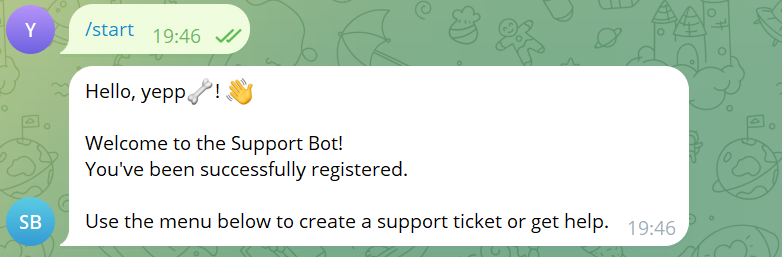
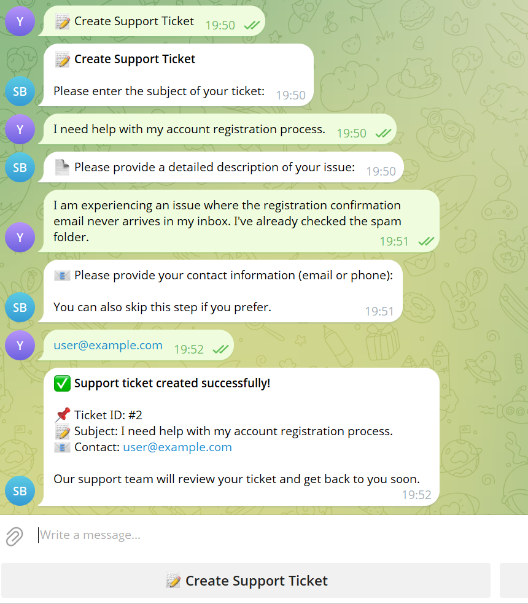
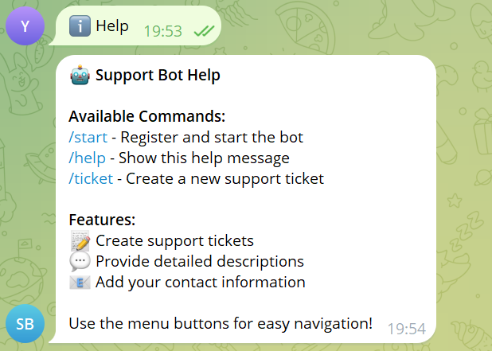

# 🤖 Telegram Support Bot — Enterprise-Ready Ticketing Service

A high-performance, asynchronous Telegram bot designed for automated user support and community management. Built with a modern Python stack, this service utilizes **Finite State Machines (FSM)** for seamless user interactions and **asynchronous database operations** for scalability.

---

## 📸 Interface Preview

### 1️⃣ Registration & Start



---

### 2️⃣ Support Ticket Workflow (FSM)



---

### 3️⃣ Help Menu



---

## 🔥 Key Capabilities

### 👤 User Interface

- **Automated Onboarding:** Intelligent `/start` logic that ensures user registration and profile synchronization in the database.
- **Interactive Ticketing:** Structured support ticket creation powered by a multi-step **Finite State Machine (FSM)**.
- **Smart Help System:** Dynamic command navigation via `/help`.

### 🛡️ Administrative Suite

- **Centralized Admin Dashboard:** Exclusive access to system management via `/admin`.
- **Massive Broadcast Engine:** Efficiently deliver announcements to the entire user base with one command.
- **Real-time Analytics:** Instant access to `/stats`, providing insights into user activity and bot performance.

---

## 🏗 System Architecture & Technology Stack

The bot follows a modular architecture, separating business logic from database management to ensure high maintainability.

- **Language:** Python 3.11+
- **Framework:** [aiogram 3.x](https://docs.aiogram.dev/) (Asynchronous Telegram Bot API)
- **Database:** PostgreSQL 16
- **ORM:** [SQLAlchemy 2.0](https://www.sqlalchemy.org/) (Async engine)
- **DevOps:** Docker & Docker Compose (Containerized deployment)

---

## 📂 Project Structure

```text
telegram_bot/
├── bot/
│   ├── handlers/       # Logic for processing commands and messages
│   ├── keyboards/      # Interactive Reply and Inline buttons
│   ├── middlewares/    # Database session injection & auth checks
│   └── states/         # FSM definitions for ticket workflows
├── database/           # PostgreSQL models and async engine setup
├── main.py             # Application entry point & polling loop
├── config.py           # Environment-based configuration
└── docker-compose.yml  # Multi-container orchestration
```

---

## 🚀 Quick Start (Local Deployment)

### 1. Prerequisites

- Docker Desktop installed.
- A Bot Token from @BotFather.

### 2. Configuration

Create a `.env` file in the root directory:

```ini
BOT_TOKEN=123456789:ABCDEF...
ADMIN_ID=your_telegram_id
DATABASE_URL=postgresql+asyncpg://user:pass@db:5432/bot_db
```

### 3. Launch

Run the automated deployment script:

```bash
docker-compose up -d --build
```

### 4. Monitoring

Check the logs to ensure the bot is connected:

```bash
docker-compose logs -f bot
```

---

## 📜 Command Reference

| Command      | Access | Description                      |
| ------------ | ------ | -------------------------------- |
| `/start`     | User   | Register and initialize the bot  |
| `/help`      | User   | View available features          |
| `/ticket`    | User   | Initiate a support request (FSM) |
| `/admin`     | Admin  | Open the Administrative Panel    |
| `/broadcast` | Admin  | Send a global message            |
| `/stats`     | Admin  | Review system usage analytics    |

---

## 👤 Author

**Andrew**

- Computer Science & AI Student
- Specializing in Python Backend & Automation
- [GitHub Profile](https://github.com/maybelaber)
- [LinkedIn](https://linkedin.com/in/andrii-borysov-9945bb3aa/)
